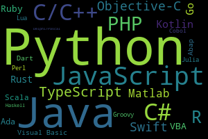

==================
Principios Básicos
==================

El mundo circundante está sujeto a cambios continuos. En mayor o menor medida, siempre lo ha estado; sin embargo, a casi nadie se le escapa que los tiempos actuales están sujetos a cambios profundos. Parte de los mismos afectan a nuestra vida cotidiana, y muy especial al mercado laboral, creándose brechas entre el mundo universitario y educativo en general y el mundo que nos rodea.

Con miras a llenar este vacío, el presente  curso está dirigido a estudiantes, profesionales, y al público en general interesado en aprender Python desde las bases. En el mismo, se ofrecerán los contenidos mínimos necesarios para manejar una base de datos con ```pandas```. Esta base de datos ha sido obtenida a partir de las *International Financial Statistics*, proporcionad por el FMI, as'i como por los datos ofrecidos por el Banco Mundial. 

Los objetivos del curso pretender dotar de principios de programación básica, con un enfasis profundo en la elaboración de proyectos concretos que potencialmente pueden ser de muy diversa naturaleza. Estos 

Este capítulo introductorio tiene un objetivo doble. En primer lugar, instalar al *software* necesario mínimo para aprender a programar con Python. Posteriormente, aprenderemos algunos principios dfundamentales de la programación con Python que nos será muy útil tener presentes a fin de facilitar el aprendizaje de los contenidos.

En principio, Python puede ser procesado desde una amplia gama de editores de texto, tales como *Visual Code, Sublime* o *Atom*. Para el manejo de datos, así como para aprender a programar, es altamente recomendable el uso de `Jupyter <https://jupyter.org>`_. 

La utilidad de su uso se hará más apreciable en cualquier caso durante la parte final del curso, cuando tratemos el manejo de datos propiamente dicho.

Instalación
===========

Sin lugar a dudas, `Anaconda <https://www.anaconda.com/>`_ es la versión más popular y extendida para instalar. Para aquellos que no tengan demasiado en introducirse en la terminal, es recomendable considerar el uso de una versión m'as ligera, denomianada `Miniconda <https://docs.conda.io/en/latest/miniconda.html>`_. 

Linux dispone de algunas distribuciones con Python incoporado, tales como Centos, Debian o Fedora. En tal caso es posible instalar Jupyter sin necesidad de Anaconda, por medio de `pip <https://pip.pypa.io/en/stable/>`_.

Popularidad
===========

La siguiente `imagen <https://pypl.github.io/PYPL.html>`_ captura los principales lenguajes de programación d1e acuerdo a las búsquedas popularidad de Python. 




Cabe preguntarse las razones principales de semejante éxito. Ninguna de ellas constituyen, todo hay que decirlo, condiciones necesarias para el  éxito de programa alguno, pudiéndose dar el caso de que otro programa alternativo cumpla estos propiedades, incluso algunas mehores, sin que su éxito se haya consolidado todavía. En todo caso, una de las razones de este éxito se debe sin duda a que Python es un lenguaje de alto nivel (*high level*). Ello implica que el lenguaje, entendido como una vía de comunicación entre el usuario y el *hardware* de su ordenador es de facil acceso para el usuario, en detrimento de la m'aquina. como contrapartida, las vías de traducción a la computadora, qla cual solo conoce el código máquina, que es un código binario con el mayor nivel de abstracción, y por lo tanto de dificultad posible. 

Programación Orientada a Objetos
================================

Existen cuatro paradigmas generales, o estilos, que caracterizan a los lenguajes de programación:

1. **Imperativos** Basados en sucesiones de pasos que se ejecutan en un orden estricto. *Ejemplo: C*

2. **Lógicos**  PROLOG

3. **Funcionales** LISP, Scheme, Haskel

4. **Orientados al Objeto** Python, C++, C#, Java

Zen de Python
=============

Beautiful is better than ugly.

Explicit is better than implicit.

Simple is better than complex.

Complex is better than complicated.

Flat is better than nested.

Sparse is better than dense.

Readability counts.

Special cases aren't special enough to break the rules.

Although practicality beats purity.

Errors should never pass silently.

Unless explicitly silenced.

In the face of ambiguity, refuse the temptation to guess.

There should be one-- and preferably only one --obvious way to do it.

Although that way may not be obvious at first unless you're Dutch.

Now is better than never.

Although never is often better than *right* now.

If the implementation is hard to explain, it's a bad idea.

If the implementation is easy to explain, it may be a good idea.

Namespaces are one honking great idea -- let's do more of those!

Alternativas
============

*R, Julia, Rust*...


